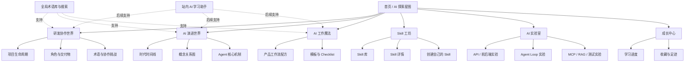

# AI 产品经理成长平台——功能需求说明

> 文档定位：用于统一产品方向、梳理功能范围，并作为后续原型设计、内容建设、技术方案和研发排期的输入。

## 1. 文档信息

| 项目 | 内容 |
|---|---|
| 项目名称 | 待定，暂称「AI 产品经理成长平台」 |
| 文档版本 | v0.1 |
| 文档状态 | 功能需求草案，待评审 |
| 创建日期 | 2026-07-13 |
| 产品形态 | 面向 AI Agent 产品经理的交互式学习网站 |
| 首要使用者 | 正在求职或转型 AI Agent 产品经理的人 |
| 本文目标 | 明确产品要解决的问题、功能模块、页面交互、内容结构、优先级、验收口径和待确认事项 |

### 1.1 优先级定义

- **P0 / MVP 必须有**：没有该功能，产品的核心价值无法成立。
- **P1 / 体验增强**：显著提升理解、练习和持续使用体验，适合 MVP 后补充。
- **P2 / 长期能力**：依赖内容规模、账号体系、AI 服务或运营能力，后续迭代。

---

## 2. 项目概述

### 2.1 一句话定位

这是一个写给未来 AI Agent 产品经理的交互式探索地图，帮助她建立技术直觉、理解研发协作、看懂 AI Agent 体系，并把大模型真正用于产品工作。

### 2.2 项目背景

目标用户已经具备较强的产品能力，但对软件研发、算法、测试和 AI 工程中的部分概念与协作链路缺乏系统认知。例如：

- 一个需求完成后，前端、后端、算法、测试分别在做什么；
- 不同角色之间依赖什么输入，交付什么产物，在哪些环节容易互相阻塞；
- API、SDK、APK、ROM、黑盒测试等术语在真实工作中意味着什么；
- LLM、Agent、Loop、Memory、MCP、Rules、Skills、Harness 等概念之间是什么关系；
- 如何使用大模型提高需求分析、PRD、原型、评审、用户反馈分析等产品工作的效率；
- 如何选择、使用和创建自己的 Skills、Rules 或其他 Agent 工具。

现有学习内容常见的问题是：知识点零散、技术语言难懂、只解释“是什么”却不解释“为什么存在”和“产品经理什么时候会遇到”。因此，本项目不做传统课程平台，而是用可探索、可互动、有陪伴感的方式，将技术世界翻译成产品经理能理解和应用的知识。

### 2.3 核心价值

1. **建立全局地图**：先知道软件研发和 AI Agent 世界的整体结构，再学习局部知识。
2. **建立技术直觉**：不仅记住名词，还能理解概念解决的问题、上下游关系和实际影响。
3. **提高协作质量**：能听懂研发、算法和测试的表达，并在评审时提出正确的问题。
4. **转化为工作能力**：能用 AI 完成真实的产品任务，而不是只会进行泛化问答。
5. **保留情感温度**：它既是学习工具，也是一个有人陪伴、持续共同建设的私人知识空间。

### 2.4 非目标

首版不追求：

- 培养能独立编写生产级代码的工程师；
- 覆盖所有计算机和 AI 知识；
- 建设完整在线教育系统、直播课或付费课程体系；
- 在 MVP 中自研通用大模型或复杂 Agent 平台；
- 用排行榜、强制打卡等方式制造学习压力；
- 仅通过堆砌年份、术语或外部链接冒充知识体系。

---

## 3. 用户与核心场景

### 3.1 目标用户

#### 核心用户

- 有产品经理经验，准备求职或转型 AI / AI Agent 产品经理；
- 产品思维较强，但技术背景不完整；
- 希望听懂技术方案、参与 AI 产品设计，并提升日常工作效率；
- 不希望从编程教材开始学习，更需要“和工作有什么关系”的解释。

#### 可扩展用户

- 传统产品经理、运营、项目经理；
- 刚进入互联网产品岗位的新人；
- 想建立 AI Agent 产品认知的非技术从业者。

### 3.2 核心使用场景

| 场景 | 用户问题 | 平台应提供的帮助 |
|---|---|---|
| 面试准备 | “面试官问 Agent 的工作流程，我只能说它会调用工具。” | 展示 Agent Loop、Harness、Tools、Memory、MCP 的关系，并提供面试表达与场景题 |
| 需求评审 | “研发说要异步化、做降级，我不知道会影响什么。” | 在研发流程节点中解释术语、依赖、风险及产品需确认的问题 |
| 日常协作 | “前后端为什么不能同时按我的 PRD 直接开发？” | 展示接口契约、Mock、联调、环境、依赖和交付物链条 |
| AI 功能设计 | “接入大模型之后，除了 Prompt 还要设计什么？” | 解释数据、检索、工具、状态、评测、护栏、兜底、可观测性 |
| 工作提效 | “我想用 AI 写 PRD，但结果很空泛。” | 提供完整任务配方：输入准备、分步指令、检查点、样例和风险提示 |
| 碎片学习 | “我只想快速弄懂 SDK 和 API 的区别。” | 支持全局搜索、对比卡、类比、真实工作对话和关联概念 |
| 自主构建 | “我会用 Skill，但不知道怎么做自己的。” | 提供 Skill 模板、创建向导、调试方法和示例库 |

### 3.3 核心用户任务

用户进入网站后，应该能够完成以下任务：

1. 选一个学习世界或从上次位置继续；
2. 沿一条流程理解上下游，而不是孤立阅读名词；
3. 点开任意节点，快速知道“是什么、为什么、与产品有什么关系”；
4. 通过一个选择题、模拟决策或小实验验证是否真正理解；
5. 收藏有用内容、记录进度，并在之后快速返回；
6. 复制一个可直接用于真实工作的模板、Checklist 或 Skill；
7. 在不理解时搜索术语，未来也可向站内 AI 助手追问。

---

## 4. 产品设计原则

### 4.1 先建立关系，再解释名词

知识内容应优先告诉用户：这个概念处在什么位置、解决什么问题、依赖谁、影响谁。术语释义只是基础层。

### 4.2 所有技术知识都回到产品工作

每个知识点至少回答一个问题：

- 产品经理为什么需要知道它？
- 在需求、评审、联调、测试或上线时会怎么遇到它？
- 如果忽略它，可能出现什么问题？
- 应该向研发、算法或测试确认什么？

### 4.3 用真实案例贯穿一条链路

研发协作模块不使用互不相关的碎片案例。首版建议选一个 AI 产品需求作为主案例，例如“为用户增加 AI 报告解读助手”，从需求交付一直演示到上线和复盘。

### 4.4 游戏化服务于理解，不喧宾夺主

地图、星球、章节、点亮节点、轻量成就用于建立探索感；不使用过度动效、复杂货币系统、体力值或强制连续签到。

### 4.5 内容要有层次

同一知识点应支持三种阅读深度：

- **30 秒**：一句话、类比、位置图；
- **3 分钟**：核心原理、工作案例、常见误区；
- **10 分钟**：完整流程、产品 Checklist、练习和关联阅读。

### 4.6 保持私人礼物的温度，但允许扩展

首位用户可拥有专属称呼、寄语和“Xuhao's Notes”；产品结构和内容模型不应写死为只能供一个人使用。

---

## 5. 产品信息架构



### 5.1 一级导航建议

| 导航项 | 目的 | 首版形态 |
|---|---|---|
| 探索 | 回到世界地图，选择模块或继续学习 | 首页默认入口 |
| 研发世界 | 理解需求完成后的完整研发协作流程 | P0 |
| AI 世界 | 理解 AI、LLM、Agent 和基础设施的演进关系 | P0 |
| 工作魔法 | 学习如何用 AI 完成产品工作 | P0 |
| Skill 工坊 | 浏览、使用并学习创建 Skill | P0 基础版 |
| 实验室 | 通过可操作实验理解抽象概念 | P1 |
| 成长中心 | 查看进度、收藏和已完成挑战 | P1；P0 可仅保留本地进度入口 |
| 搜索 | 跨模块搜索术语、流程、案例和工具 | P0 |

---

## 6. 功能范围总览

| 编号 | 功能模块 | 核心功能 | 优先级 |
|---|---|---|---|
| F01 | 首次进入与首页 | 项目寄语、模块地图、继续学习、进度概览 | P0 |
| F02 | 研发协作时间线 | 从需求交付到上线复盘的完整流程、角色和产物依赖 | P0 |
| F03 | AI 演进时间线 | AI 关键阶段、概念节点、前后因果和产品意义 | P0 |
| F04 | 知识点详情模板 | 分层解释、类比、误区、案例、Checklist、练习 | P0 |
| F05 | 术语库与全局搜索 | API、SDK、APK、ROM、黑盒测试等术语查询和关联跳转 | P0 |
| F06 | AI 工作魔法 | PRD、头脑风暴、原型、评审等可执行工作流配方 | P0 |
| F07 | Skill 工坊 | Skill 列表、详情、复制使用、创建教程 | P0 基础版 |
| F08 | 轻量练习与挑战 | 选择题、排序题、情景决策、即时解释 | P0 基础版 |
| F09 | Xuhao's Notes | 在知识点中展示私人讲解、补充经验和寄语 | P0 |
| F10 | 学习进度 | 节点完成状态、继续学习、模块完成度 | P0 本地版 |
| F11 | 收藏与历史 | 收藏知识、模板和 Skill；查看最近学习 | P1 |
| F12 | AI 实验室 | API、前后端协作、Agent Loop、MCP、RAG、测试模拟器 | P1 |
| F13 | AI 学习助手 | 基于站内知识回答问题、结合进度解释、推荐下一步 | P2 |
| F14 | 账号与云同步 | 登录、多端同步、私人数据管理 | P2 |
| F15 | 内容管理 | Markdown/MDX 内容、元数据、预览、发布和版本管理 | P0 开发侧 |
| F16 | 运营与数据 | 学习漏斗、搜索无结果、内容反馈、功能使用分析 | P1 |

---

## 7. 通用知识点详情模板

所有核心模块应共用一套知识内容结构，保证体验一致，也方便持续新增内容。

### 7.1 页面内容结构

| 区块 | 必须回答的问题 | 示例：API |
|---|---|---|
| 一句话说明 | 它是什么？ | 两个软件模块按照约定交换数据和能力的入口 |
| 它在地图中的位置 | 上游和下游是谁？ | 前端发起请求，后端处理并返回结果 |
| 为什么会出现 | 它解决了什么旧问题？ | 让不同模块不必知道对方内部如何实现 |
| 生活类比 | 有什么低门槛类比？ | 像餐厅菜单：描述可点什么、需要提供什么、会得到什么 |
| 工作现场 | 产品经理会在什么对话中遇到？ | “接口还没定义，所以前端暂时只能用 Mock 数据。” |
| 产品经理要关心 | 需要确认哪些问题？ | 输入、输出、权限、时效、错误码、失败兜底 |
| 常见误区 | 最容易误解什么？ | API 不只是一个链接，也包含调用约定和数据契约 |
| 深入原理 | 想继续学习时看什么？ | 请求方法、参数、响应、鉴权、状态码 |
| 小挑战 | 是否真正理解？ | 给出场景，选择应该向后端确认的问题 |
| 关联概念 | 下一步可看什么？ | SDK、HTTP、JSON、鉴权、Mock、联调 |
| 私人笔记 | Xuhao 如何解释或提醒？ | 结合实际开发经历给出补充 |

### 7.2 必备交互

- 支持从时间线、术语搜索、关联概念进入详情；
- 显示当前位置和所属模块，避免进入详情后迷路；
- 可在“快速理解”和“深入了解”之间展开/收起；
- 完成小挑战后给出原因解释，不能只显示对错；
- 可标记“我懂了”并点亮节点；
- P1 支持收藏、反馈“没看懂”和添加个人笔记；
- 相关知识跳转后应支持返回原学习路径。

### 7.3 内容质量要求

- 禁止只复制百科定义；
- 新术语第一次出现时应可点击或悬浮查看简释；
- 类比必须说明其边界，避免用户把类比当成完整原理；
- 重要概念应包含正确示例和错误示例；
- 涉及快速变化的 AI 产品、协议或工具时，内容需记录更新时间和来源；
- 对尚无行业统一定义的概念，应说明“不同团队可能有不同用法”。

---

## 8. F01：首页与探索星图

### 8.1 功能目标

让用户感受到这是一个专属、可探索的成长空间，并在 10 秒内知道网站能帮助自己什么、从哪里开始。

### 8.2 页面组成

#### A. 欢迎区

- 项目名称与一句话说明；
- 一段克制的私人寄语；
- 主按钮“开始探索”或“继续上次学习”；
- 次按钮“先看看这里有什么”。

#### B. 世界地图

以星球、城市或章节地图表达 4 个首版世界：

1. 研发协作世界；
2. AI 演进世界；
3. AI 工作魔法；
4. Skill 工坊。

每个入口应展示：一句话价值、预计内容量、已完成比例、最近更新内容。未上线模块可以显示“建设中”，但不可伪装成可用状态。

#### C. 继续学习

- 已有进度时，展示最近访问的知识点及所属路径；
- 点击后恢复到上次位置；
- 无进度时，推荐从“一个需求之后发生了什么”开始。

#### D. 今日推荐（P1）

- 推荐一个 3～5 分钟能完成的知识点、工作配方或挑战；
- 推荐逻辑首版可静态轮播，后续再结合进度。

### 8.3 关键规则

- 首页应突出学习路径，避免做成普通卡片导航集合；
- 私人寄语只在首次进入或主动展开时完整展示，避免每次访问造成负担；
- 世界地图在移动端可降级为纵向章节列表；
- 不登录也可以开始学习。

### 8.4 验收标准

- 用户能从首页进入全部 P0 模块；
- 首次用户与有历史进度用户看到不同主操作；
- 任一入口都明确说明“进入后能学会什么”；
- 移动端不依赖拖动画布才能访问模块；
- 模块未完成时能够保存并恢复最近位置。

---

## 9. F02：研发协作时间线

### 9.1 功能目标

让用户系统理解：需求完成后，一个功能如何经过技术评审、设计、开发、算法、联调、测试、发布和线上迭代；每个角色在何时介入、依赖什么、交付什么、为什么会阻塞。

### 9.2 主案例建议

使用一条完整案例贯穿首版，例如：

> 为健康类产品增加“AI 报告解读助手”：用户上传或查看报告后，由 AI 生成通俗解释，并允许继续追问。

选择该案例的原因：它同时涉及前端、后端、算法/模型、数据、测试、权限、内容安全、降级和上线评估，能展示传统软件与 AI 功能的差异。

具体案例和健康相关内容仅用于流程示范，不提供医疗建议。

### 9.3 主流程节点

| 阶段 | 主要角色 | 关键输入 | 核心工作 | 关键产物 | 产品经理需关注 |
|---|---|---|---|---|---|
| 1. 需求交付 | 产品、设计、业务 | 需求背景、目标、PRD | 统一范围、规则和验收口径 | PRD、流程图、原型、验收标准 | 范围是否清晰，异常场景是否完整 |
| 2. 技术评审 | 产品、前后端、算法、测试 | PRD、原型 | 判断实现方案、依赖、风险和工期 | 技术方案、问题清单、排期结论 | 是否需要数据/模型、是否有外部依赖、是否能降级 |
| 3. 方案与任务拆分 | 技术负责人、各研发角色 | 评审结论 | 设计架构、接口、数据和任务边界 | 技术设计、API 契约、任务列表 | 关键规则是否在技术方案中被正确理解 |
| 4. 并行开发 | 前端、后端、算法 | 任务和接口契约 | 编码、模型实验、数据准备、自测 | 代码、模型/Prompt、Mock、单测结果 | 依赖是否按时，方案变化是否同步 |
| 5. 算法评测 | 算法、产品、测试/评测 | 样本集、目标指标 | 建立基线，测试效果和边界 | 评测集、指标结果、失败样例 | “效果好”如何量化，哪些答案必须拒绝或兜底 |
| 6. 联调 | 前端、后端、算法 | 可用环境和接口 | 打通端到端链路 | 联调版本、问题单 | 接口字段、状态、超时、异常提示是否一致 |
| 7. 测试 | 测试、研发、产品 | 测试包、验收标准 | 功能、兼容、性能、安全和 AI 效果测试 | 测试用例、缺陷单、测试报告 | 缺陷优先级、上线阻断项、产品验收 |
| 8. 发布准备 | 产品、研发、测试、运维 | 通过测试的版本 | 配置、灰度、监控、回滚准备 | 发布单、灰度策略、回滚方案 | 用户影响、发布窗口、数据和模型版本 |
| 9. 上线与观察 | 全角色 | 线上版本和指标 | 灰度放量、监控、异常处理 | 监控数据、告警和问题记录 | 是否达到成功指标，是否需要停止放量 |
| 10. 复盘与迭代 | 产品、数据、研发、算法 | 用户反馈、指标、故障 | 复盘目标与问题，规划下一版 | 复盘结论、迭代需求 | 效果、成本、质量和用户信任是否平衡 |

### 9.4 时间线主页面

#### 展示要求

- 默认展示从需求交付到线上复盘的主链路；
- 每个节点显示角色头像/标识、状态、输入和产物；
- 点击节点打开详情面板，不强制跳离整条时间线；
- 使用连线显示依赖，区分顺序、并行和反馈回路；
- 提供“产品视角”“前端视角”“后端视角”“算法视角”“测试视角”筛选；
- 提供“传统功能”和“AI 功能”对比开关（P1）。

#### 节点详情必须包含

- 这个阶段的目标；
- 谁负责、谁配合、谁确认；
- 上一环节交付什么；
- 当前角色实际在做什么；
- 向下一环节交付什么；
- 常见专业术语；
- 常见阻塞与返工原因；
- 产品经理应确认的 Checklist；
- 一段真实工作对话；
- 一个情景挑战。

### 9.5 角色视角

用户选择一个角色后，时间线突出该角色的任务及其交接点。例如：

#### 后端视角

需求理解 → 数据模型 → API 设计 → 编码 → 单元测试 → 联调 → 发布 → 监控。

需要解释的典型概念包括：API、数据库、缓存、事务、消息队列、同步/异步、鉴权、幂等、限流、降级、日志。

#### 前端/客户端视角

原型理解 → 页面和状态设计 → 接口契约 → Mock 开发 → 联调 → 埋点 → 打包 → 发布。

需要解释的典型概念包括：前端、客户端、Web、H5、组件、状态、Mock、接口联调、APK、SDK、ROM、兼容性。

#### 算法/AI 视角

任务定义 → 数据/样本 → 方案选择 → Prompt/模型/RAG/工具设计 → 离线评测 → 服务化 → 联调 → 在线评测。

需要解释的典型概念包括：模型、推理、Token、上下文、Embedding、RAG、Function Calling、Agent、幻觉、评测集、准确率、召回率、延迟、成本、护栏。

#### 测试视角

需求分析 → 测试计划 → 测试用例 → 环境和数据准备 → 提测 → 缺陷管理 → 回归 → 发布验证。

需要解释的典型概念包括：黑盒/白盒测试、单元测试、集成测试、系统测试、回归测试、冒烟测试、测试环境、用例、缺陷等级、兼容测试、性能测试。

### 9.6 交付物链路

提供“这份东西为什么重要”的可视化链路：

需求目标 → PRD/原型 → 技术方案 → API 契约/任务 → 开发版本 → 测试用例/报告 → 发布单 → 监控和复盘。

点击任一交付物可查看：

- 由谁创建；
- 谁会使用；
- 至少应该包含什么；
- 缺失时会导致什么问题；
- 示例或模板。

### 9.7 分支和异常场景

首版至少解释以下情况：

- 技术评审发现方案不可行，需要调整需求；
- 接口尚未完成，前端如何使用 Mock 继续开发；
- 算法效果未达到上线标准；
- 外部模型/API 不稳定或超时；
- 测试发现阻断缺陷；
- 上线后指标异常，需要停止灰度或回滚；
- 产品规则在联调时出现歧义；
- 模型输出不安全或无法回答，需要兜底。

### 9.8 情景挑战示例

> 老板提出“做一个 AI 健康助手”，下一步最合理的动作是什么？

- A. 立刻让算法训练一个模型；
- B. 先明确目标用户、问题边界、数据来源、答案风险和成功指标；
- C. 先让后端创建一个接口。

提交后应解释为什么选择 B，以及 A/C 在什么条件下才可能发生。

### 9.9 验收标准

- 主流程至少覆盖上述 10 个阶段；
- 用户能看出顺序、并行任务和反馈回路；
- 每个节点都有角色、输入、工作、产物、产品 Checklist 和异常；
- 至少提供前端、后端、算法、测试四种角色视角；
- 至少有一个完整案例贯穿所有节点；
- 用户完成时间线后，能回答“每个角色何时介入、为什么会阻塞、产品要确认什么”。

---

## 10. F03：AI 演进时间线

### 10.1 功能目标

不做简单的“年份 + 名词”列表，而是让用户理解 AI 能力如何从识别和预测发展到语言生成，再发展到可调用工具、可循环执行任务的 Agent；同时理解每层基础设施为什么出现。

### 10.2 内容组织原则

每个节点必须包含：

1. 当时遇到了什么问题；
2. 新能力解决了什么；
3. 它和上一阶段相比发生了什么变化；
4. 它没有解决什么；
5. 对 AI 产品经理意味着什么；
6. 它与其他概念是什么关系；
7. 相关时间、产品和事实来源。

### 10.3 建议时代划分

| 时代 | 核心变化 | 首版重点概念 |
|---|---|---|
| 规则与传统机器学习 | 人编写规则，或用特征和数据完成预测 | 规则系统、机器学习、训练/推理、监督学习 |
| 深度学习 | 神经网络从大量数据中学习表示 | 神经网络、CNN、RNN、GPU、数据集 |
| 基础模型与大语言模型 | 一个大模型可通过语言完成多种任务 | Transformer、预训练、Token、上下文、Prompt、LLM |
| 对话与增强生成 | 模型变得可对话，并能接入外部知识 | Chat、Embedding、向量检索、RAG、上下文工程 |
| 工具使用与 Agent | 模型从“回答”走向“判断并行动” | Function Calling、Tools、Planning、Memory、Agent Loop |
| Agent 工程与生态 | 为 Agent 提供连接、约束、执行、评测和协作基础设施 | MCP、Rules、Skills、Harness、Evals、Guardrails、Observability |

> 注意：时代划分是为了帮助理解，不代表行业存在唯一、严格的分界。具体年份和案例需在内容生产阶段查证并标注来源。

### 10.4 时间线主页面

- 横向或纵向展示时代与关键节点；
- 支持按“模型能力”“产品形态”“Agent 基础设施”筛选；
- 节点之间显示“促成”“依赖”“增强”“不是同一层”等关系；
- 点击节点展开详情，关闭后回到原时间位置；
- 支持切换到“概念关系图”，从架构而非年份理解概念；
- 显示内容更新时间，避免将快速变化的信息包装成永久事实。

### 10.5 Agent 核心关系图

首版需要用一张交互图解释以下关系：

```text
用户目标
  ↓
Agent Harness（运行、状态、权限、上下文、重试、反馈）
  ↓
模型判断下一步行动
  ↓
Tool / Skill / MCP 提供能力或连接
  ↓
获得 Observation
  ↓
Memory / 当前上下文记录有效信息
  ↓
判断继续、修正、请求用户或结束
```

该图要明确：

- **模型不等于 Agent**：模型更像推理与生成核心；
- **Agent Loop**：围绕目标反复执行“判断—行动—观察—再判断”；
- **Tool**：Agent 可以执行的具体动作；
- **MCP**：一种连接 AI 应用与外部工具/数据的标准化方式，不等于工具本身；
- **Skill**：为 Agent 提供某类任务的知识、步骤、约束或可复用能力包，具体形态会因平台而异；
- **Rules**：持续约束 Agent 行为的项目或工作规则；
- **Harness**：让模型能够在真实环境中稳定执行任务的运行和控制系统；
- **Memory**：用于跨步骤或跨会话保留相关信息，不是无限保存所有内容。

### 10.6 重点概念对比

应提供可快速理解的对比卡：

| 对比 | 需要讲清楚的核心区别 |
|---|---|
| LLM vs Agent | 一个主要生成/推理，一个在运行系统中围绕目标采取行动 |
| Workflow vs Agent | 固定步骤编排与动态决策执行的区别及混合使用方式 |
| Prompt vs Context | 当前指令与模型本次可见全部信息的区别 |
| RAG vs Fine-tuning | 动态获取外部知识与改变模型行为/能力倾向的区别 |
| Tool vs MCP | 可执行能力与连接协议/标准的区别 |
| Rules vs Skills | 长期行为约束与面向特定任务的能力/流程封装 |
| Model vs Harness | 推理核心与围绕它的工具、状态、权限、重试、观测系统 |
| Memory vs Database | 面向 Agent 任务的信息保留机制与通用持久化数据系统 |

### 10.7 案例节点

对于 OpenClaw 等项目或新兴名词，应作为“生态案例”而非基础概念强行放进主干。案例页需要说明：

- 它是什么项目/产品；
- 它试图解决什么问题；
- 它位于 Agent 架构的哪一层；
- 适合用来理解什么，不适合把它等同为什么；
- 内容最后核验时间与来源。

### 10.8 验收标准

- 时间线至少覆盖 6 个认知阶段；
- 用户可以通过时间线和关系图两种方式理解内容；
- MCP、Skill、Rules、Harness、Loop 等概念不再以孤立词条呈现；
- 每个重点概念都能回答“为什么出现、解决什么、产品有什么关系”；
- 快速变化或有争议的内容均显示更新时间和来源；
- 完成模块后，用户能用自己的话解释“模型为什么不等于 Agent”。

---

## 11. F05：术语库与全局搜索

### 11.1 功能目标

让用户在开会、学习或面试前快速查清一个技术词，同时能回到它所在的完整流程和知识关系中。

### 11.2 术语分类

- 软件与系统：客户端、服务端、数据库、缓存、消息队列、日志等；
- 前端与移动端：Web、H5、组件、APK、SDK、ROM、兼容性等；
- 后端与接口：API、HTTP、JSON、RPC、鉴权、幂等、同步/异步等；
- 测试与发布：黑盒、白盒、单测、联调、回归、冒烟、灰度、回滚等；
- 数据与算法：训练、推理、特征、样本、指标、准确率、召回率等；
- 大模型与 Agent：Token、Prompt、Context、RAG、Tool、MCP、Skill、Rule、Harness、Loop、Memory、Evals 等。

### 11.3 搜索能力

- 支持中文名、英文名、缩写和常见别名；
- 搜索结果按“术语、流程节点、工作配方、Skill、案例”分组；
- 输入时给出联想结果；
- 无结果时提供相近词，并记录为内容缺口（P1）；
- 结果展示一句话解释、所属分类、关联模块；
- 点击结果进入详情，并可返回原搜索结果。

### 11.4 术语详情特有内容

- 全称、缩写、中文常用译法；
- 一句话解释；
- 生活类比及类比边界；
- 在真实协作流程中的位置；
- 典型工作对话；
- “你可能真正想问的是”；
- 易混淆概念对比；
- 相关流程、案例和练习。

### 11.5 验收标准

- 首版至少收录主流程与 AI 时间线中出现的全部核心术语；
- 用户输入缩写、中文或英文均可找到同一术语；
- 搜索结果能跳转到术语所在的流程上下文；
- 无搜索结果时页面不为空白，并提供返回或推荐内容；
- 所有术语都遵循统一内容模板。

---

## 12. F06：AI 工作魔法

### 12.1 功能目标

帮助用户把“大模型可以提高效率”转化为稳定、可复用、可检查的产品工作流，而不是提供一堆脱离场景的 Prompt。

### 12.2 首版工作流配方

| 配方 | 用户输入 | AI 辅助过程 | 主要产出 | 优先级 |
|---|---|---|---|---|
| 需求头脑风暴 | 一句话想法、背景、限制 | 澄清问题 → 用户/场景 → 方案 → 风险 → 假设 | 探索文档、待验证问题 | P0 |
| PRD 初稿 | 已确认的探索结论 | 目标 → 范围 → 流程 → 规则 → 异常 → 验收 | 结构化 PRD | P0 |
| PRD 评审检查 | PRD 或需求描述 | 多角色审查 → 逻辑缺口 → 边界 → 验收 | 评审问题和修改清单 | P0 |
| 原型准备 | 页面目标、用户任务、规则 | 信息架构 → 页面清单 → 状态 → 交互说明 | 原型说明或设计提示词 | P0 |
| 用户反馈分析 | 脱敏反馈文本或表格 | 清洗 → 分类 → 频次 → 严重度 → 机会 | 洞察、样例、建议 | P1 |
| 技术评审准备 | PRD、原型、已知依赖 | 识别接口、数据、性能、安全、AI 风险 | 评审 Checklist | P0 |
| 会议整理 | 脱敏会议记录 | 结论 → 分歧 → 行动项 → 负责人 → 截止时间 | 会议纪要和追踪项 | P1 |
| 竞品研究 | 目标问题、竞品材料 | 维度设计 → 事实提取 → 对比 → 推断分离 | 对比表、机会与待验证项 | P1 |

### 12.3 配方详情页

每个工作流都应包含：

1. **适用场景**：什么时候用，什么时候不适合用；
2. **开始前准备**：需要给 AI 哪些背景和材料；
3. **隐私提示**：哪些用户数据、公司机密不能直接输入公共模型；
4. **分步流程**：一次只完成一个清晰阶段；
5. **可复制指令/Skill**：允许用户替换变量；
6. **AI 输出示例**：展示好结果的结构；
7. **人工检查点**：哪些结论必须由产品经理确认；
8. **常见失败**：为什么输出空泛、遗漏规则或编造事实；
9. **改进方式**：如何补充上下文、拆分任务和要求证据；
10. **最终交付模板**：可复制到 Markdown、文档或设计工具；
11. **下一步动作**：将产出带入哪个后续配方。

### 12.4 串联式“一天工作流”

提供一个叙事入口，演示 AI 如何贯穿一天：

用户反馈分析 → 需求机会识别 → 头脑风暴 → PRD → 原型说明 → 技术评审 Checklist → 会议纪要 → 修改 PRD。

各任务之间应展示产物如何成为下一步输入，避免用户误以为每次都要从零写 Prompt。

### 12.5 使用规则

- 平台应反复提示：AI 产出是草稿和辅助判断，不是事实保证；
- AI 生成的需求规则、数据、用户结论必须有来源或由用户确认；
- 涉及公司或用户数据时，必须提示脱敏和工具权限；
- 模板中用明显变量标记用户需替换的内容；
- 首版可以只提供静态流程、模板和复制功能，不必立即接入模型。

### 12.6 验收标准

- P0 工作流都包含完整的“输入—过程—检查—输出—下一步”；
- 用户能一键复制模板，复制后变量和使用说明不丢失；
- 每个配方都至少有一个失败示例和人工检查点；
- 相关工作流可以前后跳转；
- 页面明确展示隐私和事实核验提醒。

---

## 13. F07：Skill 工坊

### 13.1 功能目标

让用户理解 Skill 的定位，找到可直接复用的产品经理 Skill，并通过一个可观察、可调试的过程创建自己的 Skill。

### 13.2 Skill 库

#### 列表卡片信息

- Skill 名称和一句话作用；
- 作者；
- 适用任务；
- 输入和主要输出；
- 适用平台/环境；
- 难度；
- 版本与更新时间；
- 是否为站内原创、官方或外部收录；
- “查看详情”和“复制/获取”操作。

#### 筛选与排序

- 按场景：需求、PRD、评审、原型、数据、研究、求职等；
- 按形态：Skill、Rule、Prompt 模板、MCP/工具案例；
- 按平台或兼容环境；
- 按入门难度和最近更新；
- P1 支持只看已收藏或作者为 Xuhao 的内容。

### 13.3 Skill 详情

必须包含：

- 它解决什么任务；
- 什么时候该用、什么时候不该用；
- 需要用户提供什么输入；
- 内部工作步骤；
- 输出格式；
- 示例输入和输出；
- 安装/复制/使用方式；
- 文件结构或原始内容；
- 权限、隐私和外部工具依赖；
- 已知限制；
- 版本记录和维护者；
- 关联的工作流配方。

### 13.4 “创建自己的 Skill”教程

首版以引导式教程或分步表单呈现：

1. 选择一个重复任务；
2. 明确触发条件和不适用范围；
3. 定义用户必须提供的输入；
4. 拆解稳定执行步骤；
5. 定义输出结构和质量标准；
6. 加入规则、异常处理和安全边界；
7. 准备正确、错误和边界测试案例；
8. 生成 Skill 草稿；
9. 在目标环境中安装或复制；
10. 运行测试并根据失败结果迭代。

首版不一定需要在浏览器中直接运行 Skill，但应允许复制生成的草稿并下载示例文件（是否提供下载待技术确认）。

### 13.5 概念辨析入口

工坊内提供 Skill、Prompt、Rule、Tool、MCP 的对比入口，并能跳转到 AI 演进模块中的完整解释。

### 13.6 首批建议内容

- 产品需求探索 Skill；
- PRD 生成 Skill；
- PRD 多角色评审 Skill；
- 技术评审准备 Skill；
- 原型页面拆解 Skill；
- 用户反馈分析 Skill；
- AI 功能风险检查 Skill；
- 面试问题模拟 Skill。

### 13.7 验收标准

- 用户能按场景找到 Skill；
- Skill 详情清楚说明适用范围、输入、步骤、输出、限制和版本；
- 复制或获取操作有成功反馈；
- 至少有一个完整的自建 Skill 教程和可复制模板；
- 外部收录内容必须标注来源、兼容性和最后核验时间；
- 不将 Prompt、Skill、Rule 和 MCP 混为同一概念。

---

## 14. F08：轻量练习与挑战

### 14.1 功能目标

帮助用户从“看过”走向“能够识别和应用”，同时维持轻松、没有考试压力的体验。

### 14.2 题型

- 单选/多选：判断下一步应该做什么；
- 流程排序：把联调、测试、灰度等环节放到正确位置；
- 角色匹配：判断某项产物由谁负责、谁确认；
- 对比判断：区分 API/SDK、Tool/MCP、LLM/Agent；
- 情景决策：面对算法效果不达标、接口延期、线上异常时如何处理；
- 找遗漏：在一段 PRD 或 AI 方案中找缺少的异常、评测或兜底。

### 14.3 交互规则

- 提交后立即解释正确理由和其他选项的问题；
- 答错不扣分、不制造失败惩罚；
- 允许查看相关知识后再答；
- 完成挑战可点亮对应知识节点；
- P1 记录错题主题，用于推荐复习；
- 不以模糊或有争议的行业习惯作为唯一正确答案。

### 14.4 验收标准

- 每个 P0 核心模块至少有 3 个情景挑战；
- 每道题都有解析和关联知识；
- 正确状态、错误状态、未提交状态清晰；
- 刷新或返回后能保留完成状态；
- 键盘和移动端均可完成操作。

---

## 15. F09：Xuhao's Notes 与私人表达

### 15.1 功能目标

用真实经验和个人表达为知识增加温度，让网站区别于通用课程或百科。

### 15.2 内容形态

- 首页的一封短寄语；
- 知识点末尾的“为什么我想告诉你这个”；
- 真实工作经验、踩坑和沟通场景；
- 某些章节完成后的鼓励或阶段留言；
- P1 支持语音、图片或纪念内容，但不作为首版必需。

### 15.3 展示规则

- 私人内容与客观知识视觉上明确区分；
- 私人经验不包装成普遍事实；
- 用户可以收起，不阻断正常学习；
- 后续开放给更多用户时，可配置是否展示专属内容；
- 内容表达保持真诚克制，避免页面处处出现情感文案而影响学习效率。

### 15.4 验收标准

- 首页和至少 5 个核心知识点包含私人笔记；
- 笔记可独立更新，不需要修改页面组件；
- 收起私人笔记后不影响知识内容完整性；
- 私人内容和标准知识均有清晰作者/来源属性。

---

## 16. F10/F11：学习进度、收藏与足迹

### 16.1 P0 本地进度

- 记录已查看、已完成和挑战完成的节点；
- 记录上次学习位置；
- 在首页和模块地图显示完成度；
- 支持手动标记“我懂了”或取消；
- 无账号时保存于浏览器本地；
- 清理浏览器数据可能丢失，需适当提示。

### 16.2 P1 成长中心

- 总体等级或称号，例如“AI 产品经理探索者”；
- 各模块进度，而不是给产品能力做未经依据的星级评分；
- 最近学习；
- 已完成挑战；
- 收藏的知识、配方、模板和 Skill；
- P1 可展示“能力地图”，但必须基于明确完成记录，不宣称真实职业能力已被认证。

### 16.3 状态定义

| 状态 | 含义 | 触发方式 |
|---|---|---|
| 未开始 | 从未进入节点 | 默认 |
| 学习中 | 打开过但未确认完成 | 首次打开详情 |
| 已完成 | 用户完成内容并主动确认 | 点击“我懂了”或完成指定挑战 |
| 待复习（P1） | 挑战错误或用户主动标记 | 答错/手动标记 |

### 16.4 验收标准

- 无需登录也能记录进度；
- 用户可继续上次学习；
- 完成度计算规则在不同页面一致；
- 用户可以重置本地进度，但必须二次确认；
- 进度与职业能力评价不混淆。

---

## 17. F12：AI 实验室（P1）

### 17.1 功能目标

把难以通过文字理解的技术概念变成可操作、可观察的实验。

### 17.2 建议实验

#### 实验 1：一次 API 请求发生了什么

用户填写或选择请求参数，观察：前端发出请求 → 后端校验 → 查询数据/调用模型 → 返回响应 → 前端展示；可以模拟权限失败、超时、参数错误和服务异常。

#### 实验 2：前后端如何并行开发

通过切换“接口已完成/未完成”“契约已定义/未定义”，观察 Mock、联调和返工的区别。

#### 实验 3：Agent Loop

为 Agent 设置目标，逐步观察模型决策、工具调用、工具返回、记忆更新、继续或停止。用户可故意让工具失败，观察重试、换方案或向用户求助。

#### 实验 4：RAG

对比模型仅凭已有知识回答与检索指定资料后回答，展示检索失败、资料冲突和引用来源。

#### 实验 5：MCP 是连接层，不是魔法

用“AI 应用—MCP Client—MCP Server—外部系统”的可视化，允许用户连接/断开不同服务，观察能力变化与权限边界。

#### 实验 6：测试一个 AI 功能

用户选择正常、边界、对抗和异常样例，观察功能正确性、模型效果、安全和性能并不是同一类测试。

### 17.3 实验通用结构

- 学习目标；
- 可调整输入；
- 运行/下一步操作；
- 当前系统状态；
- 可视化结果；
- “刚刚发生了什么”解释；
- 尝试异常情况；
- 实验总结和关联知识。

### 17.4 验收标准

- 每个实验都有正常路径和至少一个异常路径；
- 每一步操作后都能看到状态变化及原因；
- 实验不依赖真实生产系统或敏感数据；
- 失败状态可恢复或重新开始；
- 用户完成后能跳转到相关知识点。

---

## 18. F13：站内 AI 学习助手（P2）

### 18.1 功能目标

用户可以围绕站内内容追问，并获得与当前知识节点、学习程度和产品经理视角一致的解释。

### 18.2 核心能力

- 回答站内知识相关问题；
- 在当前页面追问“再简单一点”“给一个工作例子”“它和 X 有什么区别”；
- 引用对应知识页面和来源；
- 根据已完成内容控制解释深度；
- 推荐下一步知识，而不是无限展开话题；
- 无依据时明确表示不确定，并引导查证或补充内容。

### 18.3 AI 行为要求

- 默认站在产品经理视角解释；
- 区分事实、类比、个人经验和推断；
- 不编造产品、协议、时间节点或来源；
- 医疗、法律、财务等高风险示例只用于产品设计讨论，不提供专业结论；
- 不将用户输入用于公开展示；
- 对超出知识库的问题给出边界提示。

### 18.4 降级策略

- AI 服务不可用时保留搜索与关联内容推荐；
- 回答失败时允许重新尝试或查看站内固定内容；
- 不允许 AI 助手故障阻塞主学习路径。

---

## 19. F15：内容管理与内容模型

### 19.1 首版建议

内容采用 Markdown/MDX 或等价的文件驱动方式维护，页面组件读取结构化元数据。这样可以先把精力放在知识质量和交互体验，不必在 MVP 中开发完整后台。

### 19.2 核心内容类型

| 类型 | 用途 |
|---|---|
| LearningPath | 一条学习路径，如研发协作时间线 |
| Stage | 路径中的阶段/时代 |
| KnowledgeNode | 具体知识点 |
| GlossaryTerm | 术语词条 |
| Role | 前端、后端、算法、测试等角色 |
| Deliverable | PRD、API 契约、测试报告等产物 |
| Scenario | 贯穿流程的案例 |
| Challenge | 选择、排序、匹配和情景题 |
| WorkflowRecipe | AI 产品工作配方 |
| SkillItem | Skill、Rule、模板或工具案例 |
| PersonalNote | 私人寄语和经验补充 |
| Source | 事实来源和最后核验信息 |

### 19.3 KnowledgeNode 建议字段

```yaml
id: api
title: API
aliases: [接口, Application Programming Interface]
category: backend
summary: 一句话解释
why_it_exists: 解决的问题
analogy: 类比
analogy_limit: 类比边界
pm_relevance: 产品经理为什么要知道
workflow_scene: 真实工作场景
common_mistakes: []
checklist: []
related_nodes: [sdk, http, mock, integration]
challenge_ids: []
personal_note_id: note-api-01
difficulty: beginner
estimated_minutes: 5
updated_at: 2026-07-13
source_ids: []
status: draft
```

### 19.4 内容状态

| 状态 | 含义 | 用户侧展示 |
|---|---|---|
| Draft | 草稿，尚未完成审核 | 不展示 |
| Review | 等待内容或事实审核 | 不展示或仅预览环境展示 |
| Published | 已发布 | 正常展示 |
| Outdated | 可能过时，等待复核 | 显示更新时间提醒或暂时下线 |
| Archived | 已被替代 | 不进入主路径，旧链接可说明替代内容 |

### 19.5 内容发布要求

- 必填字段校验；
- 关联节点不得指向不存在的内容；
- 时间线顺序和依赖关系可配置；
- 内容预览与正式页面一致；
- 快速变化内容必须有 `updated_at` 和来源；
- 发布前检查移动端、链接、代码/图示和挑战答案；
- P1 提供简单的内容完整度检查脚本。

---

## 20. 全局交互与页面状态

### 20.1 导航

- 桌面端提供固定或清晰可见的一级导航；
- 移动端使用折叠菜单或底部关键入口；
- 详情页显示面包屑/所属路径；
- 浏览器前进后退应保持正确位置和筛选状态；
- 深层知识页可通过 URL 直接访问和分享。

### 20.2 通用状态

每个涉及数据加载或交互的页面都需要：

- 加载状态；
- 空状态；
- 错误状态；
- 无搜索结果；
- 内容建设中；
- 操作成功反馈；
- 网络恢复或重试入口。

### 20.3 响应式

- 桌面端时间线可横向探索；
- 移动端转为纵向步骤，不强迫用户进行精细拖拽；
- 关系图在小屏幕上提供聚焦单节点和列表替代视图；
- 触控目标不小于常用可访问尺寸；
- 长表格在移动端转换为卡片或可水平滚动并保留标题。

### 20.4 可访问性

- 关键功能可以通过键盘操作；
- 焦点状态清晰；
- 颜色不是表达节点状态的唯一方式；
- 动画尊重减少动态效果设置；
- 图标配文字或可访问标签；
- 正文、按钮和状态信息满足合理对比度；
- 交互图提供文本替代说明。

---

## 21. 数据指标与埋点建议

### 21.1 首版成功信号

首版主要验证“是否能帮助目标用户建立认知并愿意继续使用”，不应只看访问量。

| 目标 | 建议指标 | 说明 |
|---|---|---|
| 用户看懂价值 | 首页到核心模块进入率 | 用户是否知道从哪里开始 |
| 用户愿意深入 | 单次完成的知识节点数、节点完成率 | 是否只停留在首页 |
| 形成路径认知 | 时间线阶段完成率 | 是否走完整条链路 |
| 内容确实可理解 | 挑战首次正确率、重试后正确率、“没看懂”反馈 | 找出解释薄弱点 |
| 可用于工作 | 模板/Checklist/Skill 复制率 | 是否产生实际使用价值 |
| 形成持续使用 | 7 日内再次访问、继续学习使用率 | 是否具备陪伴价值 |
| 发现内容缺口 | 无结果搜索词、低点击搜索结果 | 指导新增术语和内容 |

### 21.2 关键事件

| 事件 | 触发时机 | 关键属性 |
|---|---|---|
| home_view | 打开首页 | 是否首次、是否有进度 |
| module_enter | 进入模块 | 模块、入口来源 |
| node_open | 打开知识点 | 节点、路径、来源、阅读深度 |
| node_complete | 标记完成 | 节点、完成方式、耗时 |
| challenge_submit | 提交挑战 | 题目、是否正确、尝试次数 |
| search_submit | 执行搜索 | 查询词、结果数 |
| search_result_click | 点击搜索结果 | 查询词、结果类型、排名 |
| template_copy | 复制模板 | 配方/Skill、内容类型 |
| content_feedback | 提交没看懂/有帮助 | 节点、反馈类型 |
| resume_learning | 点击继续学习 | 节点、距离上次访问时间 |

### 21.3 数据边界

- 不采集不必要的私人内容；
- 不在埋点中上传用户粘贴的 PRD、公司资料或搜索中的敏感全文；
- 首版若仅供私人使用，可先实现最小匿名统计，甚至仅记录本地进度；
- 上线数据分析前需要补充隐私说明和数据保留规则。

---

## 22. 非功能需求

### 22.1 性能

- 首屏核心内容应快速可见，世界地图动效不得阻塞主操作；
- 长时间线和关系图采用按需加载或合理分段；
- 图片和动效资源进行压缩并提供静态降级；
- 搜索在本地内容规模下应接近即时反馈。

### 22.2 兼容性

- 优先适配最新两个主要版本的 Chrome、Safari、Edge；
- 支持常见桌面和移动端尺寸；
- 不将鼠标悬浮作为唯一的信息获取方式。

### 22.3 安全与隐私

- 模板演练默认使用虚构案例；
- 用户粘贴内容前显示脱敏提醒；
- 外部链接明确提示将离开本站；
- 如未来支持账号和 AI 助手，需要补充鉴权、数据删除、模型供应商和隐私策略；
- Skill 涉及文件、邮箱、数据库等权限时必须明确展示风险。

### 22.4 可维护性

- 内容与页面组件分离；
- 术语、角色、案例、挑战可以复用，不在多处手工复制；
- 时间线顺序、关联和状态由数据驱动；
- 新增知识点无需修改核心页面代码；
- 站内链接和必填字段可自动检查。

### 22.5 SEO 与分享

- 非私人知识页应有独立标题、摘要和可分享 URL；
- 私人寄语和成长数据默认不被搜索引擎索引；
- 分享卡片显示知识点名称和一句话解释，不泄露私人内容。

---

## 23. MVP 范围与版本规划

### 23.1 MVP（建议先完成）

#### 产品骨架

- 首页与四个世界入口；
- 全局导航、搜索、响应式布局；
- 统一知识点详情组件；
- 本地学习进度与继续学习。

#### 核心内容

- 一条完整研发协作时间线；
- 一条完整 AI 演进时间线；
- 核心术语库；
- 4 个 AI 产品工作流配方；
- 至少 4 个 Skill 详情和 1 个自建 Skill 教程；
- 每个核心模块至少 3 个挑战；
- 首页和核心知识点中的私人笔记。

#### MVP 建议内容量

| 内容类型 | 建议最小数量 |
|---|---:|
| 研发流程阶段 | 10 |
| 角色视角 | 4 |
| AI 演进阶段 | 6 |
| 深度知识节点 | 30～40 |
| 术语词条 | 60～80 |
| 工作流配方 | 4 |
| Skill | 4 |
| 情景挑战 | 12～20 |
| 私人笔记 | 6～10 |

> 这里强调“最小可形成完整体验的内容量”，不是最终知识库规模。此前设想的 200 个知识点更适合作为长期内容目标。

### 23.2 V1.1：体验增强

- 收藏、足迹和待复习；
- 传统功能/AI 功能流程对比；
- 概念关系图增强；
- “一天的 AI 工作流”串联体验；
- API、Agent Loop 等首批 2～3 个互动实验；
- 内容反馈和无结果搜索分析；
- 更多 Skill、工作配方和角色挑战。

### 23.3 V2：智能陪伴

- 账号和跨设备同步；
- 站内 AI 学习助手；
- 根据进度和错题推荐学习路径；
- 在线生成 Skill 草稿并进行测试；
- 个人笔记和学习总结；
- 更完整的内容编辑、审核和发布后台。

---

## 24. MVP 用户主流程

### 24.1 第一次进入

打开网站 → 阅读简短寄语和定位 → 点击开始探索 → 进入研发协作世界 → 看到完整项目链路 → 打开“技术评审”节点 → 阅读快速解释 → 展开产品 Checklist → 完成情景题 → 点亮节点 → 返回时间线 → 继续下一节点。

### 24.2 快速查词

打开搜索 → 输入“SDK” → 查看一句话解释和 API 对比 → 进入术语详情 → 阅读真实工作场景 → 跳转到客户端开发阶段 → 返回原搜索结果。

### 24.3 实际工作提效

进入 AI 工作魔法 → 选择“PRD 评审检查” → 查看需要准备的输入 → 复制模板 → 阅读隐私和人工检查点 → 使用后返回 → 收藏或进入“技术评审准备”。

### 24.4 学习 Skill

进入 Skill 工坊 → 按“需求”筛选 → 查看需求探索 Skill → 理解输入、步骤和输出 → 复制/获取 → 进入创建教程 → 用自己的重复任务生成一个 Skill 草稿。

---

## 25. 整体 MVP 验收标准

### 25.1 功能验收

- 首页、研发世界、AI 世界、工作魔法、Skill 工坊、搜索均可完整访问；
- 用户能从任意核心知识点回到所属学习路径；
- 进度可在刷新和重新打开浏览器后恢复；
- 搜索覆盖标题、别名、缩写和分类；
- 模板和 Skill 内容可以可靠复制；
- 挑战具备提交、反馈、解析和完成记录；
- 未完成内容、错误、空状态均有明确说明。

### 25.2 内容验收

- 研发流程、AI 演进和术语使用统一定义；
- 每个核心节点符合统一详情模板；
- 关键技术事实有来源和更新时间；
- 类比不会替代或扭曲真实原理；
- 每个模块都回答产品经理“我为什么要知道”；
- 私人经验与客观知识有明确区分。

### 25.3 体验验收

- 新用户无需说明即可找到推荐起点；
- 桌面和移动端均能完成全部主流程；
- 页面不因动效造成明显眩晕、卡顿或操作阻塞；
- 键盘可完成导航、展开内容和提交挑战；
- 用户不会把建设中功能误认为已上线功能。

### 25.4 认知验收

邀请目标用户完成首轮体验后，至少能够：

- 复述需求从评审到上线的主要阶段；
- 说出前端、后端、算法和测试之间的关键交付物；
- 解释 LLM 与 Agent、Tool 与 MCP、Rules 与 Skills 的基本区别；
- 为一个 AI 功能列出效果评测、异常、成本和安全方面的确认项；
- 独立使用至少一个工作流配方完成真实产品任务。

---

## 26. 依赖与风险

| 风险 | 具体表现 | 应对策略 |
|---|---|---|
| 范围过大 | 同时建设几十个互动页面和数百知识点，长期无法上线 | 先完成一条端到端路径，每类内容只做最小代表集 |
| 内容像百科 | 术语很多，但无法改善实际协作 | 强制使用“流程位置 + 工作现场 + 产品 Checklist + 练习”模板 |
| 游戏化过度 | 地图炫酷但查找困难、移动端不可用 | 地图与列表并存，任何动效不阻塞核心导航 |
| AI 内容快速过时 | MCP、平台 Skill 等细节变化 | 标注来源、版本、更新时间，并设置 Outdated 状态 |
| 概念定义不统一 | 不同平台对 Skill、Memory 等用法不同 | 区分通用概念与具体平台实现，明确适用上下文 |
| AI 助手幻觉 | 助手给出错误技术事实 | AI 助手后置；限制站内知识、要求引用、提供降级 |
| 个性化造成压力 | 能力星级像在评价用户不足 | 使用探索进度，不使用无依据的人格或能力评分 |
| 私人内容影响扩展 | 所有页面写死名字和专属故事 | 将私人内容做成可配置内容层 |
| 敏感数据泄露 | 用户把真实 PRD、反馈直接粘贴到公共模型 | 模板前置脱敏提醒，未来接入 AI 时明确数据策略 |
| 维护成本失控 | 同一概念在多页重复、更新不一致 | 内容实体化、关联引用、统一术语源和自动链接检查 |

---

## 27. 当前待确认事项

以下问题不阻塞开始做信息架构和首版原型，但会影响品牌、内容和技术方案。

### 27.1 产品与品牌

1. 正式名称是什么：AI Galaxy、AI Adventure、专属中文名，还是其他名称？
2. 产品首版只给一个人使用，还是从第一天就按可公开访问设计？
3. 专属称呼、人物名字和私人寄语是否可以公开展示？
4. 整体世界观选择“星际探索”“技术城市”“博物馆”还是更克制的叙事？

### 27.2 内容

5. 研发协作主案例使用什么业务场景？是否采用“AI 报告解读助手”？
6. 首版知识深度更偏求职面试、实际工作协作，还是两者各占一半？
7. 需要优先覆盖 Android/客户端概念，还是 Web/服务端协作？
8. 首批 Skill 是展示现有真实文件，还是先用示例内容？
9. OpenClaw 在项目中具体指哪个产品/开源项目，准备把它作为哪类案例？
10. 私人笔记由谁撰写，是否需要独立的内容模板和审核流程？

### 27.3 技术与发布

11. 是否沿用 Next.js + TypeScript + Tailwind + Framer Motion 的技术方向？
12. 是否需要部署到公开域名，还是先做本地/私有预览？
13. 首版是否完全不登录，仅用浏览器本地保存进度？
14. 内容是否由 Git + Markdown/MDX 维护，是否需要非技术人员可用的后台？
15. 首版是否接入真实大模型，还是只提供静态工作流和模板？
16. 外部 Skill 是否提供下载、跳转，还是只做介绍和复制？

### 27.4 验证

17. 首轮最重要的验证结果是什么：她愿意继续用、能看懂研发流程、能应对面试，还是能完成真实工作任务？
18. 是否可以安排目标用户在原型阶段完成一次 30 分钟可用性测试？
19. 哪些知识是她当前最急需的，可以作为首页默认学习路径？

---

## 28. 建议的下一步产出

1. 对本文的 MVP 范围和待确认事项做一次产品评审；
2. 确认项目名称、世界观、主案例和首版目标；
3. 产出 MVP 页面清单与低保真信息架构原型；
4. 建立研发流程和 AI 演进两条时间线的首批内容目录；
5. 定义统一内容 Schema，并先制作 3 个完整知识点验证模板；
6. 确认视觉方向后制作首页、时间线、知识详情三个关键高保真页面；
7. 再进入技术架构、任务拆分和开发排期。

---

## 附录 A：建议的 MVP 页面清单

| 页面 | 路由示例 | 优先级 |
|---|---|---|
| 首页/探索星图 | `/` | P0 |
| 研发协作时间线 | `/development` | P0 |
| 研发节点详情 | `/development/[node]` | P0 |
| AI 演进时间线 | `/ai-history` | P0 |
| AI 概念关系图 | `/ai-history/map` | P0 |
| AI 知识节点详情 | `/ai-history/[node]` | P0 |
| 术语库 | `/glossary` | P0 |
| 术语详情 | `/glossary/[term]` | P0 |
| 全局搜索结果 | `/search` | P0 |
| 工作魔法列表 | `/workflows` | P0 |
| 工作配方详情 | `/workflows/[recipe]` | P0 |
| Skill 工坊 | `/skills` | P0 |
| Skill 详情 | `/skills/[skill]` | P0 |
| 创建 Skill 教程 | `/skills/create` | P0 |
| 成长中心 | `/progress` | P1 |
| AI 实验室列表 | `/lab` | P1 |
| 实验详情 | `/lab/[experiment]` | P1 |

## 附录 B：首批内容目录建议

### B.1 研发协作

- PRD、原型、验收标准；
- 技术评审、技术方案、任务拆分、排期；
- 前端、客户端、后端、服务端、算法、测试、运维；
- API、SDK、APK、ROM、HTTP、JSON、RPC；
- Mock、联调、环境、配置、日志、监控；
- 单元测试、黑盒测试、冒烟测试、回归测试；
- 提测、缺陷等级、发布、灰度、回滚；
- 数据库、缓存、消息队列、同步/异步、幂等；
- 埋点、指标、告警、复盘。

### B.2 AI 与 Agent

- 机器学习、深度学习、神经网络、训练、推理；
- Transformer、基础模型、LLM、Token、上下文、Prompt；
- Embedding、向量检索、RAG；
- Function Calling、Tool、Workflow、Agent；
- Planning、Agent Loop、Memory、Observation；
- MCP、Rules、Skills、Harness；
- Evals、Guardrails、Observability；
- 幻觉、延迟、成本、上下文窗口、模型选择；
- 离线评测、在线指标、失败兜底、人工接管。

### B.3 产品工作提效

- 如何准备高质量上下文；
- 如何把一次性 Prompt 变成稳定工作流；
- 需求探索；
- PRD 生成与评审；
- 原型信息架构；
- 技术评审 Checklist；
- 用户反馈分析；
- 事实核验和隐私保护；
- Skill 的选择、安装、使用、测试和迭代。
