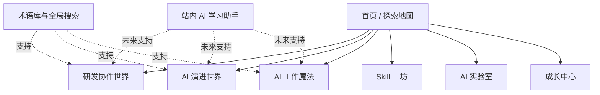

# withtutu

> 一张写给未来 AI Agent 产品经理的交互式探索地图。

`withtutu` 是一个面向 AI / AI Agent 产品经理的成长平台。它希望用流程、案例、互动实验和可以直接带回工作的工具，帮助不以技术见长的产品经理建立技术直觉，理解研发协作和 Agent 体系，并真正使用 AI 提高工作效率。

它不是传统课程网站，也不是术语百科。我们更希望它像一个有人陪伴的技术世界：每个知识点都能说明自己为什么存在、位于哪里、与产品工作有什么关系。

## 项目要解决的问题

- 一个需求完成后，前端、后端、算法、测试如何协作，分别交付什么；
- API、SDK、APK、ROM、黑盒测试等技术词汇在真实工作中意味着什么；
- LLM、Agent、Loop、Memory、MCP、Rules、Skills、Harness 之间是什么关系；
- 产品经理在设计 AI 功能时，除了 Prompt 还应考虑哪些数据、评测、安全和兜底问题；
- 如何使用 AI 完成需求探索、PRD、原型、技术评审和用户反馈分析；
- 如何选择、使用、测试并创建自己的 Skill。

## 核心体验

### 1. 研发协作世界

通过一条完整的项目生命周期，理解需求从交付到上线复盘之间发生了什么：

```text
需求交付 → 技术评审 → 方案与任务拆分 → 并行开发
        → 算法评测 → 联调 → 测试 → 发布准备
        → 上线观察 → 复盘迭代
```

用户可以切换产品、前端、后端、算法和测试视角，查看每个阶段的输入、实际工作、交付物、专业术语、常见阻塞和产品经理 Checklist。

### 2. AI 演进世界

用“能力为什么发生变化”组织 AI 发展历程，而不是罗列年份和名词：

```text
规则与机器学习
  ↓
深度学习
  ↓
基础模型与大语言模型
  ↓
对话与检索增强
  ↓
工具使用与 Agent
  ↓
MCP、Skills、Rules、Harness、Evals 等 Agent 工程生态
```

每个节点都会解释：它解决了什么问题、和上一阶段有什么不同、还没有解决什么，以及产品经理为什么需要知道。

### 3. AI 工作魔法

将 AI 提效整理成可复用的工作流，而不是零散 Prompt：

- 需求头脑风暴；
- PRD 初稿与多角色评审；
- 原型信息架构与页面拆解；
- 技术评审准备；
- 用户反馈分析；
- 会议整理和竞品研究。

每个工作流都包含输入准备、分步过程、可复制模板、人工检查点、失败示例、隐私提醒和下一步动作。

### 4. Skill 工坊

提供面向产品工作的 Skill 库，并通过分步教程帮助用户创建自己的 Skill：

```text
选择重复任务 → 定义输入和边界 → 拆解步骤
→ 约定输出 → 增加异常与安全规则 → 准备测试案例
→ 生成草稿 → 安装/复制 → 测试和迭代
```

### 5. 术语库与互动学习

- 支持中文、英文、缩写和别名搜索；
- 从术语回到它所在的协作流程或 Agent 架构；
- 通过类比、工作对话、常见误区和概念对比帮助理解；
- 使用选择题、流程排序、角色匹配和情景决策验证认知；
- 记录学习进度，支持从上次位置继续。

## 产品结构



## 知识内容原则

每个核心知识点都应回答：

1. 它是什么；
2. 它为什么会出现；
3. 它位于完整流程或架构的哪里；
4. 产品经理会在什么工作现场遇到它；
5. 产品经理应该确认什么；
6. 最容易出现什么误解；
7. 可以通过什么练习验证自己真的理解了。

同一内容支持三种阅读深度：

- **30 秒**：一句话、类比和位置图；
- **3 分钟**：核心原理、工作案例和常见误区；
- **10 分钟**：完整流程、Checklist、练习与关联阅读。

## MVP 范围

第一版聚焦形成一条完整、可用的学习体验：

| 模块 | MVP 内容 |
|---|---|
| 首页 | 探索地图、项目寄语、模块入口、继续学习 |
| 研发协作 | 10 个生命周期阶段、4 个角色视角、一个贯穿案例 |
| AI 演进 | 6 个认知阶段、Agent 核心关系图、重点概念对比 |
| 术语库 | 60～80 个研发、测试和 AI Agent 核心术语 |
| 工作魔法 | 需求探索、PRD、原型准备、技术评审 4 个完整配方 |
| Skill 工坊 | 至少 4 个 Skill 和 1 个自建 Skill 教程 |
| 互动学习 | 12～20 个情景挑战、本地学习进度 |
| 私人表达 | 首页寄语和核心知识点中的个人经验笔记 |

账号同步、完整 AI 实验室和站内 AI 学习助手将在核心体验得到验证后建设。

## 版本规划

### MVP：建立完整学习路径

- 完成首页和四个核心世界；
- 建立统一知识内容模型；
- 上线两条核心时间线、术语搜索、工作配方和 Skill 基础能力；
- 使用浏览器本地数据保存进度。

### V1.1：增强互动与持续学习

- 收藏、足迹和待复习；
- 传统软件功能与 AI 功能研发流程对比；
- API、Agent Loop、RAG、MCP 等互动实验；
- 更多工作配方、Skill 和角色挑战。

### V2：加入智能陪伴

- 账号和跨设备同步；
- 基于站内知识的 AI 学习助手；
- 根据学习进度推荐路径；
- 在线创建和测试 Skill；
- 更完整的内容编辑与发布能力。

## 当前状态

项目目前处于需求定义与概念设计阶段：

- [x] 完成项目背景与方向讨论
- [x] 完成功能需求整理
- [ ] 确认正式名称、视觉世界观和首版主案例
- [ ] 完成 MVP 信息架构与低保真原型
- [ ] 建立首批知识内容和数据结构
- [ ] 确认技术方案并开始开发

完整需求请阅读：[《AI 产品经理成长平台——功能需求说明》](./AI产品经理成长平台-功能需求说明.md)。

## 候选技术方向

技术方案尚未最终确认，当前候选方向为：

- Next.js + TypeScript；
- Tailwind CSS；
- Framer Motion；
- Markdown / MDX 驱动知识内容；
- 首版本地保存学习进度，后续再引入账号和云端数据。

技术选择将以内容可维护性、交互表现、移动端体验和快速完成 MVP 为主要判断标准。

## 我们希望它最终成为

> 当你面对算法、研发、模型和不断变化的 AI 世界时，不会觉得陌生，而是可以自信地说：我知道它是什么，也知道它为什么存在。
